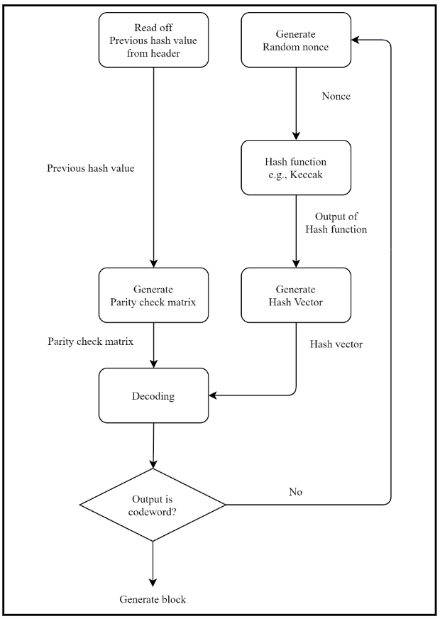

## WIP-2: ECCPoW: Error-Correction Code based Proof-of-Work for ASIC Resistance
 
<b>Author</b> Seungmin Kim, Haewoong Choi, Gyeongdeok Maeng, Minho Yoon
<b>Created</b> 2024-05-03

### Table of Contents
* [Abstract](#abstract)
* [Motivation](#motivation)
* [ERROR-CORRECTION CODES PROOF OF WORK](#error-correction-codes-proof-of-work)
  - [Block header in ECCPoW](#block-header-in-eccpow)
  - [Overall structure of ECCPoW](#overall-structure-of-eccpow)
  - [Construction of hash vector and parity check matrix in ECCPoW](#construction-of-hash-vector-and-parity-check-matrix-in-eccpow)
  - [Construction of ECC puzzle generation functions and ECC puzzles](#construction-of-ecc-puzzle-generation-functions-and-ecc-puzzles)
* [Implementation](#implementation)
* [References](#references)
* [Copyright](#copyright)

### Abstract
ECCPoW is a proof-of-work consensus protocol that utilizes error-correcting codes and decoders [1]. It employs a time-varying puzzle generation mechanism, where the puzzle changes for each block, to suppress specialized mining equipment. ECCPoW is used as the consensus mechanism for the EVM blockchain WorldLand [2].

### Motivation
Proof-of-work-based consensus protocols have proven to be secure and robust due to their simple rules, and have served as a solid foundation for cryptocurrencies such as Bitcoin and Ethereum. Proof-of-work has inherent economic value and security because it requires real resource consumption to participate in the network. Therefore, even though Ethereum's consensus mechanism has transitioned to proof-of-stake, there are still voices supporting and maintaining the PoW mechanism.
We apply the ECCPoW proof-of-work consensus mechanism to the WorldLand blockchain. ECCPoW is superior to other proof-of-work consensus algorithms in that it suppresses the emergence of specialized mining equipment such as ASICs by using a time-varying puzzle generation mechanism that creates different puzzles for each block.

### ERROR-CORRECTION CODES PROOF OF WORK
#### Block header in ECCPoW

When using ECCPoW, the EVM header additionally includes the Codeword, which is the result of the decoder value, and the CodeLength, which represents the length of the code. Due to the use of LDPC-based decoders, three parameters are required: code length, row degree, and column degree. However, for the simplicity of the protocol, the row and column degrees are fixed at 3 and 4, respectively, so only the CodeLength is stored in the header. Fixing the row and column degree values implies that the CodeLength indirectly represents the difficulty of ECCPoW.

```go
// Header represents a block header in the Ethereum blockchain.
type Header struct {
	ParentHash  common.Hash    `json:"parentHash"       gencodec:"required"`
	UncleHash   common.Hash    `json:"sha3Uncles"       gencodec:"required"`
	Coinbase    common.Address `json:"miner"`
	Root        common.Hash    `json:"stateRoot"        gencodec:"required"`
	TxHash      common.Hash    `json:"transactionsRoot" gencodec:"required"`
	ReceiptHash common.Hash    `json:"receiptsRoot"     gencodec:"required"`
	Bloom       Bloom          `json:"logsBloom"        gencodec:"required"`
	Difficulty  *big.Int       `json:"difficulty"       gencodec:"required"`
	Number      *big.Int       `json:"number"           gencodec:"required"`
	GasLimit    uint64         `json:"gasLimit"         gencodec:"required"`
	GasUsed     uint64         `json:"gasUsed"          gencodec:"required"`
	Time        uint64         `json:"timestamp"        gencodec:"required"`
	Extra       []byte         `json:"extraData"        gencodec:"required"`
	MixDigest   common.Hash    `json:"mixHash"`
	Nonce       BlockNonce     `json:"nonce"`

	// BaseFee was added by EIP-1559 and is ignored in legacy headers.
	BaseFee *big.Int           `json:"baseFeePerGas" rlp:"optional"`
	// Codeword was added by WorldLand 
	Codeword []byte            `json:"codeword" rlp:"optional"`
	// CodeLength was added by WorldLand 
	CodeLength uint64          `json:"codelength" rlp:"optional"`
	
}
```
#### Overall structure of ECCPoW

The figure below illustrates the overall structure of ECCPoW. ECCPoW consists of three parts: 1. Hash vector and parity check matrix generation, 2. LDPC decoder execution, and 3. Result determination.

1. In the hash vector generation part, a random hash vector $r$ of length $n$ is generated using the $Keccak512$ function, taking a random nonce and the current block header value as inputs. Additionally, a parity check matrix (PCM) $H$, which determines the relationship between the input and its corresponding output, is generated.

2. The LDPC decoder part contains a decoder from the LDPC code family. This decoder takes the above hash vector and parity check matrix as inputs and executes a message-passing algorithm to generate a binary output vector $c$.

3. Finally, in the result determination part, a decision is made based on the output provided by the decoder, as shown in Figure 1.

<p align="center">
  
</p>


#### Construction of hash vector and parity check matrix in ECCPoW

##### Hash Vector Generation

The hash vector $r$ in ECCPoW is computed as follows. The current block header (CBH) and a randomly generated nonce value are used as inputs. If $n$ is less than 512, $r$ is generated by executing a single $Keccak$ function. However, if $n$ is greater than 512, the $Keccak$ function is executed repeatedly to generate $r$ with a length of $n$.

$$ 
r := 
\begin{cases} 
s_1 [1:n] & \text{if } n \leq 512 \\
s_1 \ldots s_l, s_{l+1} [1:j] & \text{if } n > 512 
\end{cases} \quad 
$$

where $l = \lfloor \frac{n}{512} \rfloor$, $j = n - 512 \times l$,

$s_1 := Keccak512(Keccak256(CBH)∣∣nonce) \in \{0,1\}^{512}$

and

$$ s_u := Keccak512(s_{u-1}) \in \{0,1\}^{512} $$ 


The hash vector is uniquely determined by the nonce value. Miners can generate a new hash vector by changing the nonce value, which is identical to the characteristics of existing proof-of-work systems.

##### Parity Check Vector Generation

Parameters such as the code length $n$, row degree $w_r$, and column degree $w_c$ are used to generate the parity check matrix H. These parameters allow the allocation of the number of rows $m$ := $n \times \frac{w_c}{w_r}$ in H. Here, the row degree $w_r$ and column degree $w_c$ have fixed values of 3 and 4, respectively.

The matrix generation method is based on Gallager's approach [3]. It constructs a matrix H that can be decomposed into a set of submatrices of size $\frac{m}{w_c} \times n$. H is represented as follows:

$$ 
H = 
\begin{bmatrix}
A \\
\pi_1 (A) \\
\vdots \\
\pi_{w_c - 1} (A)
\end{bmatrix} \in \{0,1\}^{m \times n} \quad 
$$

Here, $\pi_i (A)$ is the $i^{th}$ submatrix obtained by randomly permuting the columns of $A$, and $\pi_i$ is the order of the $i^{th}$ permutation. The base matrix $A$ is constructed such that each row has $w_r$ consecutive 1s at different positions, and it is defined as follows:

$$
A :=
\begin{bmatrix}
1_{w_r} & 0_{w_r} & \ldots & 0_{w_r} \\
0_{w_r} & 1_{w_r} & \ldots & 0_{w_r} \\
\vdots & \vdots & \ddots & \vdots \\
0_{w_r} & 0_{w_r} & \ldots & 1_{w_r}
\end{bmatrix} \in \{0,1\}^{m/w_c \times n}
$$

$where$
$$1_{w_r} := [1 \ \ldots \ 1] \in 1^{w_r}, $$
$$0_{w_r} := [0 \ \ldots \ 0] \in 0^{w_r}. $$

#### Construction of ECC puzzle generation functions and ECC puzzles

The decoder takes the generated hash vector $r$ and parity check vector $H$ as inputs and produces an output vector $c$ of size $n$ through a message-passing algorithm.

$$ D_{\text{mp}} : \{r, H\} \mapsto c \in \{0,1\}^{n \times l} $$

The output vector $c$ is verified to determine if it is a valid codeword. There is a problem that codewords with either too small or too large Hamming weights can be easily found without going through the decoder. For example, if $c$ is a zero vector, $Hc$ is always 0. Therefore, this problem is solved by allowing only $c$ with a Hamming weight within a certain range as valid codewords. Denoting the Hamming weight of the codeword $c$ as $W(c)$, the set of valid codewords C is defined as follows:

$$C := \{c \in  \{0,1\}^{n \times l}|Hc = 0_n, \ \frac{n}{4}< W(c) < \frac{3n}{4} \} $$

If the output vector does not satisfy the above condition, the miner generates a new nonce and repeats all the steps. If the output vector satisfies the above condition, the miner stores the corresponding $c$, $n$, and nonce value in the block header and broadcasts the block. Nodes receiving the block verify the codeword and nonce of the block and add the block to the blockchain.

### Implementation

The reference implementation is part of ETH-ECC and has been functioning as the consensus engine for the WorldLand blockchain since August 2023 [4].

### References
[1] Park, S., Choi, H., & Lee, H. N. (2020). Time-variant proof-of-work using error-correction codes. arXiv preprint arXiv:2006.12306.

[2] R. G. Gallager, (1962). Low-density parity-check codes. IRE Transactions on information theory, 8(1), 21-28.

[3] Kim, H., Jang, J., Park, S., & Lee, H. N. (2021). Error-correction code proof-of-work on Ethereum. IEEE Access, 9, 135942-135952.

[4] https://github.com/cryptoecc/ETH-ECC/tree/master/consensus/eccpow


### Copyright
Copyright and related rights waived via CC0.

### Citation
Please cite this document as:
