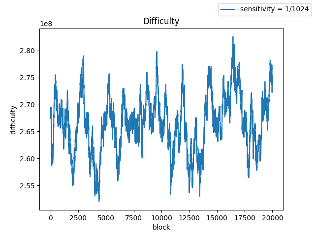
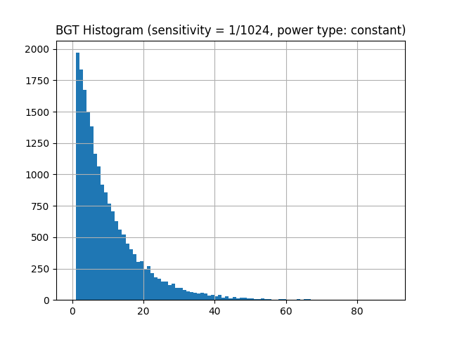
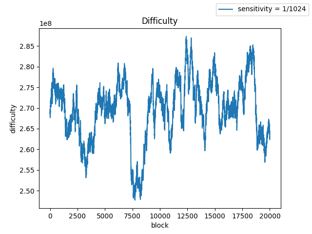
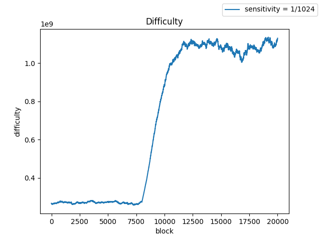
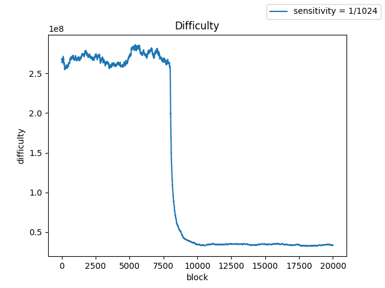
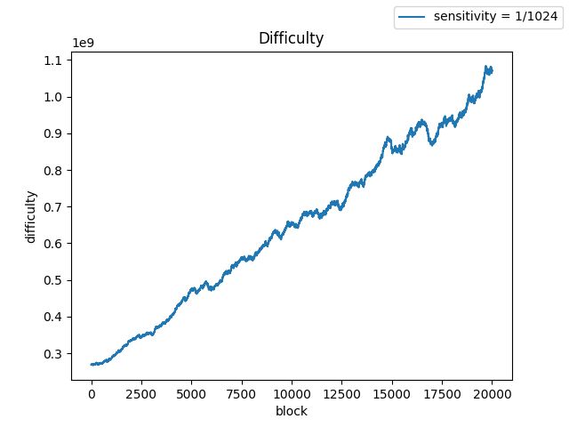

## WIP-5: Update Sensitivity of WorldLand Difficulty Control Algorithm

<b>Author</b> Seungmin Kim 
<b>Created</b> 2024-05-05

### Table of Contents
* Abstract
* Motivation
* Specification
* Simulation Result
* Conclusion
* Implementation
* Reference

### Abstract
이 문서는 월드랜드 하드포크에서 진행되는 난이도 조절 알고리즘의 업데이트를 서술합니다[1].

### Motivation
월드랜드 난이도 조절 알고리즘의 현재 민감도는 1/8로 설정되어 있는데 이는 너무 높습니다. 이 설정에서는 블록의 블록 생성 시간(BGT)이 90초를 초과하면 다음 블록의 난이도가 최소 난이도 값으로 급격하게 감소합니다. 

이 문제를 해결하려면 감도(S)를 줄여야 합니다. 본 보고서에서는 네트워크 계산 능력을 제대로 추종하기 위해 적절한 민감도 값을 제안하는 것을 목표로 합니다.

민감도 값을 변경하면 합의 프로토콜이 수정되므로 블록체인의 하드포크가 실행됩니다. 민감도(S)는 블록의 난이도를 결정하는데, 이는 합의 프로토콜을 통해 검증해야 하는 중요한 변수입니다. 

이 업데이트가 이루어진 후에는 업데이트된 프로토콜을 따르는 노드는 더 이상 사용되지 않는 프로토콜을 따르는 노드가 채굴한 블록을 허용하지 않으며 그 반대의 경우도 마찬가지입니다.

### Specification
월드랜드(ECCPoW)의 난이도 조절 알고리즘은 다음과 같습니다. 다음 블록의 난이도는 해당 블록의 블록 생성 시간(BGT)에 대응하여 현재 난이도를 높이거나 낮추는 것으로 결정됩니다. 현재 월드랜드의 민감도 $S$는 $\frac{1}{8}$ 입니다.

$$
d_{i+1} = 
\begin{cases} 
d_i + d_i \frac{ \max\left(2 - \frac{|BGT_i|}{10}, -99\right)}{8}, & \text{if uncle block exists,} \\
d_i + d_i\frac{ \max\left(1 - \frac{|BGT_i|}{10}, -99\right)}{8}, & \text{elsewhere.}
\end{cases}
$$

네트워크 컴퓨팅 능력이 급격히 변할 때, 높은 민감도는 난이도 값이 이를 추적하도록 하여 평균 블록 생성 시간을 유지하는 데 도움이 됩니다. 그러나 동시에 실제 네트워크 컴퓨팅 능력이 변하지 않는 경우에는 심각한 난이도 교란을 일으킬 수 있습니다. BGT에 따른 난이도의 변화를 민감도의 함수로 표현할 수 있으며 다음과 같이 해석할 수 있습니다.

- $10 <= BGT < 20$이면 난이도를 변경하지 않습니다.
- $BGT < 10$ 인 경우 난이도를 $(1+S)D$로 높입니다.
- $BGT > 20$ 인 경우 난이도를 $(1−kS)D$로 낮춥니다. 이 때 $k = \lfloor \frac{BGT_i}{10} \rfloor - 1$ 이고 $k$가 -99보다 클 경우 $k$는 $-99$로 고정됩니다(난이도 감소 하한).

여기서 최대 증가율은 $(1+S)$로 제한되고 최대 감소율은 $\frac{-99}{S}$임을 알 수 있습니다. 증가하는 난이도는 보수적이어야 합니다. 블록체인의 난이도가 급격히 높아지면 해당 블록의 BGT가 상당히 길어져 모든 거래에 심각한 지연이 발생할 수 있습니다. 반대로 난이도를 낮추는 것은 사용자 입장에서는 심각한 문제가 없기 때문에 증가하는 것보다 더 공격적일 수 있습니다.

초기 월드랜드 네트워크의 경우 네트워크 해시 파워의 급격한 증가와 감소에 적응하기 위해 민감도를 1/8로 설정하였습니다. 최근 월드랜드 네트워크가 대중화되면서 많은 사용자들이 채굴 경쟁에 참여하고 있습니다. 결과적으로 WorldLand의 네트워크 해시파워는 획기적으로 증가했습니다. 현 시점에서는 몇몇 노드가 새로 가입하거나 탈퇴해도 더 이상 해시 파워에 큰 변화가 발생하지 않습니다. 이는 더 이상 BGT의 높은 변동성을 감수하면서 높은 민감도를 유지할 이유가 없다는 것을 의미합니다.

감도를 낮추면 평균 BGT에 의도하지 않은 변화가 발생합니다. 이를 보완하기 위해 우리는 WL의 난이도를 제어하기 위해 다음 공식을 제안합니다.

$$ 
d_{i+1} = 
\begin{cases} 
d_i + d_i \frac{ \max\left(2 - \frac{|BGT_i|}{7}, -99\right)}{1024}, & \text{if uncle block exists,} \\
d_i + d_i\frac{ \max\left(1 - \frac{|BGT_i|}{7}, -99\right)}{1024}, & \text{elsewhere.}
\end{cases}
$$

즉, 민감도를 $\frac{1}{1024}$로 설정하고 임계값을 7로 설정했습니다. 난이도의 작은 변동성으로 목표 BGT(10초)를 달성할 수 있을 것으로 기대합니다.

### Simulation Result

우리는 BGT는 기하 분포를 가지는 랜덤 변수이고 삼촌 블록이 없다고 가정합니다. 우리는 네트워크 컴퓨팅 성능에 대한 다양한 시나리오를 사용하여 20000개 블록에 대한 난이도와 BGT를 시뮬레이션했습니다. 

<b>i.	해시 파워가 일정한 경우</b>  
난이도가 초기 값의 $\pm 6$% 이내에서 유지되는 것을 확인할 수 있습니다. BGT 또한 의도한 대로의 분포를 가짐을 확인할 수 있습니다.

  
  

| Statistic   | Value   |
|-------------|---------|
| Mean BGT    | 9.85605 |
| Variance    | 87.34060|
| Maximum BGT | 90.0    |

<b>ii. 컴퓨팅 성능이 작은 변화를 가지는 경우</b>  
컴퓨팅 성능을 정규화된 MSE = 0.01을 충족하는 추가 백색 가우스 잡음이 있는 상수로 모델링한 시나리오의 결과입니다. 앞선 첫 번째 시나리오와 비슷하지만 약간 증가된 분산값을 가집니다. 난이도는 초기 값의 $\pm 8$% 이내에서 유지됩니다.

  

 
| Statistic   | Value   |
|-------------|---------|
| Mean BGT    | 9.87925 |
| Variance    | 91.40784|
| Maximum BGT | 93.0    |

<b>iii. 컴퓨팅 성능의 급격한 증가 시나리오</b>  
이번에는 네트워크 컴퓨팅 파워가 급격히 증가하는 시나리오를 고려합니다. 이 시나리오는 대규모 채굴자가 블록체인에 새로 합류할 때 발생할 수 있습니다. 우리는 8000번째 블록에서 네트워크 컴퓨팅 파워가 초기 값의 4배로 증가한다고 모델링했습니다. 아래 표는 네트워크 컴퓨팅 파워의 변화를 난이도가 따라잡는데 필요한 응답 시간을 보여줍니다. 

  

| Statistic   | Value   |
|-------------|---------|
| 90% Response Time (blocks)        | 2341   |
| 70.71% Response Time (blocks)     | 1504   |
| Theoretical Response Time (blocks)| 1421   |

<b>iv. 급격한 감소</b>  
이번에는 네트워크 컴퓨팅 성능이 급격히 감소하는 시나리오를 고려합니다. 이 시나리오는 대규모 광부가 채굴을 중단하거나 일시적으로 연결이 끊어졌을 때 발생할 수 있습니다. 가파른 증가 시나리오에서도 비슷한 결과를 볼 수 있습니다.

  

| Statistic   | Value   |
|-------------|---------|
| 90% Response Time (blocks)        | 1546 |
| 70.71% Response Time (blocks)     | 832  |

<b>v. 꾸준한 증가</b>  
네트워크 컴퓨팅 파워가 20000 블록에 걸쳐 선형적으로 증가하고 최종적으로 초기 값의 4배에 도달했다고 가정합니다. 참고로 블록당 증가율은 최대 증가율보다 작습니다. 삼촌이 없다고 가정할때 최대 견딜 수 있는 증가율은 $1+\frac{1}{1024} = 1.0009766$ 입니다. 시뮬레이션에서 가정된 증가율은 $4^{\frac{1}{20000}} = 1.000069317$ 으로, 최대 증가율 이하이므로 컴퓨팅 파워 변화를 잘 따라잡을 수 있습니다.

  

### Conclusion
시뮬레이션 결과는 우리의 새로운 공식의 난이도가 네트워크의 연산량 변화에 적절하게 대응함을 보여줍니다.

### Implementation
https://github.com/cryptoecc/WorldLand/blob/worldland/consensus/eccpow/LDPCDifficulty.go 에 구현되어 있습니다. 

### Citation
Please cite this document as:
